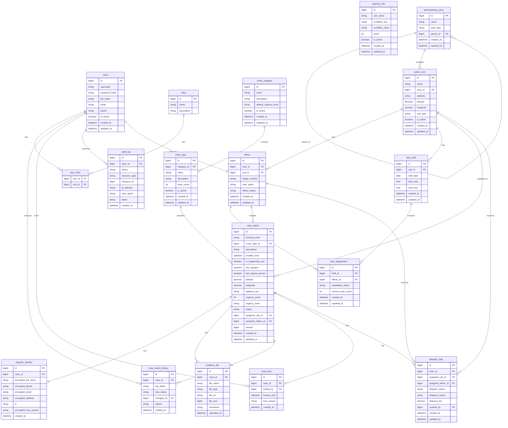

# 04. Entity Relationship Diagram

## 1. Tổng quan

Tài liệu này mô tả thiết kế cơ sở dữ liệu cho hệ thống Tiếp nhận và Điều phối Thông tin Tố giác Tội phạm.

Thiết kế ERD tập trung vào phiên bản MVP, bao gồm các nhóm dữ liệu chính:

- Người dùng và phân quyền
- Danh mục tội phạm
- Hồ sơ tin báo
- Danh tính người tố giác
- Bằng chứng
- Địa bàn và đơn vị công an
- Cán bộ và ca trực
- Điều phối tin báo
- Khóa hồ sơ
- Lịch sử trạng thái
- Audit log

---

## 2. Danh sách bảng trong MVP

| Nhóm | Bảng | Mục đích |
|---|---|---|
| User & Role | users | Lưu tài khoản đăng nhập |
| User & Role | roles | Lưu danh sách quyền |
| User & Role | user_roles | Liên kết user với role |
| Crime Catalog | crime_category | Nhóm loại tội phạm |
| Crime Catalog | crime_type | Loại tội phạm cụ thể |
| Crime Catalog | urgency_rule | Rule tính điểm nguy cấp |
| Report Case | case_report | Hồ sơ tin báo chính |
| Report Case | reporter_identity | Thông tin định danh người tố giác đã mã hóa |
| Report Case | evidence_file | File bằng chứng |
| Report Case | case_status_history | Lịch sử thay đổi trạng thái |
| Report Case | case_lock | Khóa hồ sơ tạm thời |
| Dispatch | administrative_area | Địa bàn hành chính |
| Dispatch | police_unit | Đơn vị công an |
| Dispatch | officer | Cán bộ |
| Dispatch | duty_shift | Ca trực |
| Dispatch | duty_assignment | Phân công cán bộ theo ca |
| Dispatch | dispatch_task | Nhiệm vụ điều phối |
| Audit | audit_log | Lịch sử thao tác hệ thống |

---

## 3. Thiết kế bảng chi tiết

---

### 3.1. Bảng users

Lưu thông tin tài khoản đăng nhập của cán bộ, chỉ huy, admin.

```text
users
- id
- username
- password_hash
- full_name
- email
- phone
- is_active
- created_at
- updated_at
```

Ghi chú:

- Người dân trong MVP chưa cần tài khoản.
- Người dân gửi tin báo công khai và nhận tracking code.
- Cán bộ, điều phối viên, chỉ huy và admin cần đăng nhập.

### 3.2. Bảng roles

Lưu danh sách vai trò trong hệ thống.

```text
roles
- id
- name
- description 
```

Dữ liệu mẫu:

| name | description |
|---|---|
| DUTY_OFFICER | Cán bộ trực ban |
| DISPATCHER | Cán bộ điều phối |
| COMMANDER | Chỉ huy |
| ADMIN | Quản trị viên |

### 3.3. Bảng user_roles

Liên kết nhiều-nhiều giữa users và roles.

```text
user_roles
- user_id
- role_id
```

Một user có thể có nhiều role.

### 3.4. Bảng crime_category

Lưu nhóm loại tội phạm.

```text
crime_category
- id
- code
- name
- description
- default_urgency_level
- is_active
- created_at
- updated_at
```

Ví dụ dữ liệu:

| name | default_urgency_level |
|---|---|
| Tội phạm trật tự xã hội | HIGH |
| Ma túy | HIGH |
| Kinh tế | MEDIUM |
| Không gian mạng | MEDIUM |

### 3.5. Bảng crime_type

Lưu loại tội phạm cụ thể.

```text
crime_type
- id
- category_id
- code
- name
- description
- base_score
- is_active
- created_at
- updated_at
```

Ví dụ:

| category | name | base_score |
|---|---:|---|
| Tội phạm trật tự xã hội | Cướp giật | 30 |
| Tội phạm trật tự xã hội | Gây rối trật tự | 20 |
| Ma túy | Mua bán trái phép chất ma túy | 35 |
| Không gian mạng | Lừa đảo online | 15 |

Quan hệ:

```text
crime_category 1 - n crime_type
```

### 3.6. Bảng urgency_rule

Lưu rule tính điểm nguy cấp.

```text
urgency_rule
- id
- rule_name
- condition_key
- condition_value
- score
- is_active
- created_at
- updated_at
```

Ví dụ dữ liệu:

| condition_key | condition_value | score |
|---|---:|---|
| HAS_WEAPON | true | 40 |
| HAPPENING_NOW | true | 30 |
| HAS_INJURED_PERSON | true | 30 |
| EVIDENCE_TYPE | VIDEO | 10 |

Ghi chú:

- Bảng này giúp hệ thống thay đổi cách tính điểm mà không cần sửa code.
- Trong MVP, có thể seed dữ liệu ban đầu bằng Flyway.

## 4. Nhóm bảng tin báo

### 4.1. Bảng case_report

Đây là bảng trung tâm của hệ thống.

```text
case_report
- id
- tracking_code
- crime_type_id
- description
- incident_time
- is_happening_now
- has_weapon
- has_injured_person
- latitude
- longitude
- address_text
- urgency_score
- urgency_level
- status
- assigned_unit_id
- assigned_officer_id
- version
- created_at
- updated_at
```

Ý nghĩa một số field quan trọng:

| Field | Ý nghĩa |
|---|---|
| tracking_code | Mã tra cứu ẩn danh cho người dân |
| crime_type_id | Loại tội phạm |
| description | Mô tả vụ việc |
| latitude, longitude | Tọa độ xảy ra vụ việc |
| urgency_score | Điểm nguy cấp |
| urgency_level | LOW, MEDIUM, HIGH, CRITICAL |
| status | Trạng thái xử lý |
| assigned_unit_id | Đơn vị được giao xử lý |
| assigned_officer_id | Cán bộ được giao xử lý |
| version | Dùng cho optimistic locking |

Trạng thái hợp lệ:

```text
NEW_RECEIVED
UNDER_VERIFICATION
TRANSFERRED_TO_INVESTIGATION
RESOLVED
SPAM_OR_FAKE    
```

Quan hệ:

```text
crime_type 1 - n case_report
police_unit 1 - n case_report
officer 1 - n case_report
```

### 4.2. Bảng reporter_identity

Lưu thông tin định danh người tố giác sau khi mã hóa.

```text
reporter_identity
- id
- case_id
- encrypted_full_name
- encrypted_phone
- encrypted_email
- encrypted_address
- iv
- encryption_key_version
- created_at
```

Ghi chú bảo mật:

- Không lưu họ tên, số điện thoại, email dạng plaintext.
- Mỗi bản ghi có IV riêng.
- Dữ liệu định danh được tách khỏi bảng case_report.
- Chỉ API nội bộ có quyền đặc biệt mới được giải mã.

Quan hệ:
```
case_report 1 - 1 reporter_identity
```

### 4.3. Bảng evidence_file

Lưu metadata của file bằng chứng.

```text
evidence_file
- id
- case_id
- file_name
- original_file_name
- file_type
- mime_type
- file_url
- file_size
- checksum
- uploaded_at
```

Giải thích các field

```
file_name          tên file sau khi hệ thống lưu
original_file_name tên gốc người dân upload
file_type          IMAGE / VIDEO / AUDIO / DOCUMENT / OTHER
mime_type          image/png, video/mp4...
file_url           đường dẫn file local/MinIO/S3
file_size          dung lượng file
checksum           mã kiểm tra toàn vẹn file
uploaded_at        thời điểm upload
```

Ghi chú:

- File thật nên lưu ở local storage hoặc MinIO.
- Database chỉ lưu metadata và đường dẫn file.
- checksum dùng để kiểm tra file có bị thay đổi không.

Quan hệ:

```
case_report 1 - n evidence_file
```

### 4.4. Bảng case_status_history

Lưu lịch sử thay đổi trạng thái của tin báo.

```text
case_status_history
- id
- case_id
- old_status
- new_status
- changed_by
- reason
- created_at
```

Ví dụ:

| old_status | new_status | reason |
|---|---:|---|
| NEW_RECEIVED | UNDER_VERIFICATION | Cán bộ trực ban nhận xử lý |
| UNDER_VERIFICATION | TRANSFERRED_TO_INVESTIGATION | Đã xác minh sơ bộ |
| TRANSFERRED_TO_INVESTIGATION | RESOLVED | Hoàn tất xử lý |

Quan hệ:

```text
case_report 1 - n case_status_history
users 1 - n case_status_history
```

### 4.5. Bảng case_lock

Lưu khóa hồ sơ tạm thời.

```text
case_lock
- id
- case_id
- locked_by
- locked_until
- lock_reason
- created_at
```

Mục đích:

- Tránh hai cán bộ cùng nhận xử lý một tin báo.
- Tránh hai điều phối viên cùng gán một tin báo.
- Tránh ghi đè trạng thái khi nhiều người thao tác cùng lúc.

Quan hệ: 

```text
case_report 1 - n case_lock
users 1 - n case_lock
```

Ghi chú:

- Chỉ lock chưa hết hạn mới được xem là active.
- Có thể cho phép nhiều record lịch sử lock, nhưng tại một thời điểm chỉ một active lock.

## 5. Nhóm địa bàn, đơn vị và cán bộ

### 5.1. Bảng administrative_area

Lưu đơn vị hành chính theo dạng cây.

```text
administrative_area
- id
- name
- area_type
- parent_id
- created_at
- updated_at
```

Ví dụ:

| id | name | area_type | parent_id |
|---|---:|---|---|
| 1 | TP. Hồ Chí Minh | CITY | null |
| 2 | Quận 1 | DISTRICT | 1 |
| 3 | Phường Bến Nghé | WARD | 2 |

Quan hệ:

```text
administrative_area 1 - n administrative_area
```

### 5.2. Bảng police_unit

Lưu thông tin đơn vị công an.

```text
police_unit
- id
- name
- area_id
- address
- latitude
- longitude
- unit_type
- is_active
- created_at
- updated_at
```

Ví dụ:

| name | unit_type |
|---|---|
| Công an Phường Bến Nghé | WARD_POLICE |
| Công an Quận 1 | DISTRICT_POLICE |
| Đội Cảnh sát Hình sự | CRIMINAL_POLICE |
| Trung tâm 113 | EMERGENCY_CENTER |

Quan hệ:
```text
administrative_area 1 - n police_unit
```

### 5.3. Bảng officer

Lưu thông tin cán bộ.

```text
officer
- id
- user_id
- unit_id
- badge_number
- rank_name
- officer_status
- created_at
- updated_at
```

Ví dụ officer_status:

```text
ACTIVE
INACTIVE
ON_LEAVE
```

Quan hệ:
```text
users 1 - 1 officer
police_unit 1 - n officer
```

### 5.4. Bảng duty_shift

Lưu ca trực.

```text
duty_shift
- id
- unit_id
- shift_date
- start_time
- end_time
- created_at
- updated_at
```

Ví dụ:

| unit | shift_date | start_time | end_time |
|---|---|---|---|
| Công an Phường Bến Nghé | 2026-05-25 | 08:00 | 16:00 |

Quan hệ:

```text
police_unit 1 - n duty_shift
```

### 5.5. Bảng duty_assignment

Lưu cán bộ được phân công trong từng ca trực.

```text
duty_assignment
- id
- shift_id
- officer_id
- availability_status
- current_case_count
- created_at
- updated_at
```

Ví dụ availability_status:

```text
AVAILABLE
BUSY
OFFLINE
ON_CASE
```

Quan hệ:

```text
duty_shift 1 - n duty_assignment
officer 1 - n duty_assignment
```

## 6. Nhóm điều phối

### 6.1. Bảng dispatch_task

Lưu nhiệm vụ điều phối tin báo.

```text
dispatch_task
- id
- case_id
- assigned_unit_id
- assigned_officer_id
- dispatch_status
- dispatch_reason
- distance_km
- created_by
- created_at
- updated_at
```

Ví dụ dispatch_status:

```text
ASSIGNED
WAITING_ASSIGNMENT
REASSIGNED
CANCELLED
```

Ví dụ dispatch_reason:

```text
Tin báo mức CRITICAL, đơn vị gần nhất có cán bộ trực rảnh.
```

Quan hệ:

```text
case_report 1 - n dispatch_task
police_unit 1 - n dispatch_task
officer 1 - n dispatch_task
users 1 - n dispatch_task
```

Ghi chú:

- Một case có thể có nhiều dispatch_task nếu bị điều phối lại.
- case_report.assigned_unit_id và case_report.assigned_officer_id lưu trạng thái gán hiện tại.
- dispatch_task lưu lịch sử điều phối.

## 7. Nhóm audit

### 7.1. Bảng audit_log

Lưu lịch sử thao tác quan trọng.

```text
audit_log
- id
- actor_id
- action
- resource_type
- resource_id
- ip_address
- user_agent
- detail
- created_at
```

Ví dụ action:

```text
CASE_CREATED
CASE_ASSIGNED
CASE_ACCEPTED
CASE_LOCKED
CASE_UNLOCKED
CASE_STATUS_CHANGED
REPORTER_IDENTITY_DECRYPTED
URGENCY_SCORE_CALCULATED
```

Mục đích:

- Truy vết ai đã làm gì.
- Kiểm soát thao tác với dữ liệu nhạy cảm.
- Hỗ trợ báo cáo và kiểm tra nội bộ.

Quan hệ:

```text
users 1 - n audit_log
```

### 8. ERD dạng Mermaid


